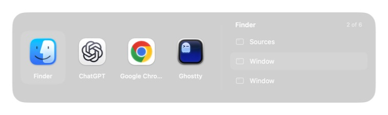
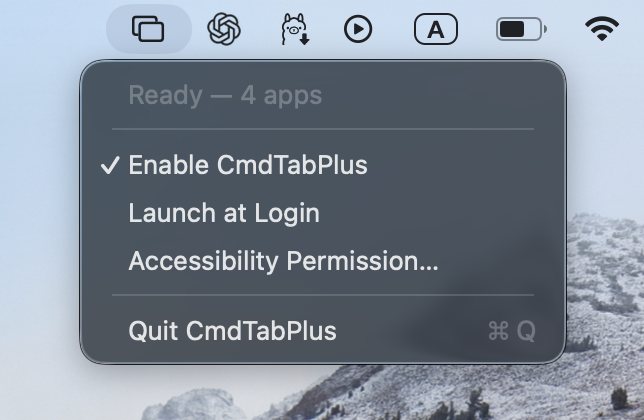

# CmdTabPlus

**The macOS app switcher, with windows.**

Hold **Command** and press **Tab** to move through apps and their windows. Release Command to switch. If your current app has several windows, you visit its other windows first, then continue to the next app.



A centered, native switcher with a window list that expands to the right. Liquid Glass on macOS Tahoe; native materials on earlier versions. Other shortcuts—including Command+grave—stay with macOS.

## Install

**macOS 13 or later · Apple silicon and Intel**

1. [Download the latest release](https://github.com/nidhalmessaoudi/CmdTabPlus/releases/latest), open the DMG, and drag **CmdTabPlus** to **Applications**. A ZIP is also available.
2. Open the app. This first release is **ad-hoc signed, not Developer ID signed or notarized**. If macOS blocks it, follow [Apple’s Open Anyway instructions](https://support.apple.com/en-us/102445) in **System Settings → Privacy & Security**.
3. Allow **CmdTabPlus** in **Privacy & Security → Accessibility**, then enable it from its menu-bar icon.

Accessibility lets CmdTabPlus handle Command+Tab, read window titles, and focus the selected window. No screen-recording permission, screenshots of your windows, or network access. Nothing patches the Dock or changes system files; disabling or quitting restores native switching.



The menu has enable/disable, launch at login, Accessibility settings, and quit.

## Current limitations

- Window discovery and focus depend on each app’s Accessibility support. Spaces and full-screen transitions remain under macOS’s control.
- App order follows activity observed while CmdTabPlus is running; it cannot read the native switcher’s private history.
- Updating an ad-hoc-signed build can invalidate Accessibility access. Remove its old entry and re-add the copy in Applications if switching stops working.
- Tested on Apple silicon with macOS Tahoe. The Intel build and older-macOS fallback compile, but haven’t been tested on those machines.

## Build

Requires **Xcode 26 or newer**. Open `Package.swift` in Xcode, or run:

```sh
./Scripts/build.sh
open build/CmdTabPlus.app
swift test
```

`./Scripts/package-release.sh` builds a universal app and creates a DMG, ZIP, and SHA-256 checksums in `dist/`. Set `CODE_SIGN_IDENTITY` to use your own signing identity; notarization is separate.

[MPL-2.0 license](LICENSE)
